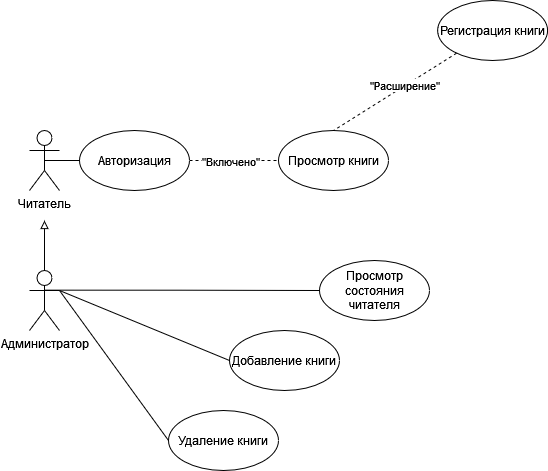
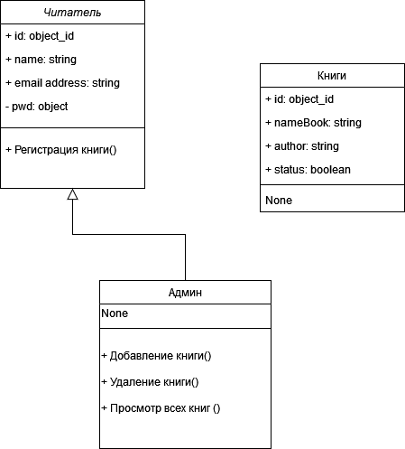

# Electronic Library #

Название системы — электронная библиотека.
***  <!-- !!!! убрать -->

## Description ##

Электронная библиотека предназначена для:

* хранения книг;
* добавления книг;
* просмотра книг;
* удаления книг
* контроль пользователя администратором.

#### Diagram Precedent ####

<!---->

#### Diagram Class ####
<!-- -->

## Technologies in the project ##

Платформа для выполнения этой задачи node.js, база данных mongoDB

#### Справка ####

* название (желательно и его изображение тоже. Отредактировать можно на canva.com, если вы не специалист по графическому дизайну);
* описание (с использованием слов и изображений);
* демо (изображения, ссылки на видео, интерактивные демо-ссылки);
* технологии в проекте;
* что-то характерное для проекта (проблемы, с которыми пришлось столкнуться, -  уникальные составляющие проекта);
* техническое описание проекта (установка, настройка, как помочь проекту).